# Ankit Pandey

  <picture>
    <source media="(prefers-color-scheme: dark)" srcset="./dark.svg">
    <source media="(prefers-color-scheme: light)" srcset="./light.svg">
    
  </picture>

## About

I am a B.Tech Computer Science Engineering student specializing in Artificial Intelligence and Machine Learning, building skills across AI/ML, web development, and problem solving.

## Focus

- Artificial Intelligence & Machine Learning
- Full-stack web development
- Data structures & algorithms
- Building practical software projects
- Learning through open-source and hands-on development

## Engineering Stack

**Languages:** C++, Python, JavaScript

**Frontend:** HTML, CSS, React.js

**Backend:** Node.js, Express.js, REST APIs, JWT

**Database:** MongoDB, Mongoose

**AI / ML:** NumPy, Pandas, scikit-learn, PyTorch, FastAPI

**Tools:** Git, GitHub, VS Code, Thunder Client

## Featured Projects

### LearnKart
Educational marketplace built around a MERN stack approach, with JWT authentication, role-based access, and MongoDB-based data management.

### DeepGuard
AI/ML project focused on anomaly detection and identifying unusual activity.

## Currently Building

Strengthening software engineering, AI/ML, DSA, communication, and open-source contribution skills through consistent project-based practice.

## Connect

Personal profile links are intentionally omitted here because no personal GitHub, LinkedIn, portfolio, or email URLs were supplied.

---

  Built as a self-contained GitHub profile interface · no external assets · SVG-native animation

